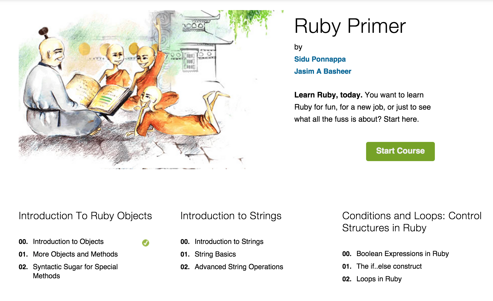

Max’s Super Cool Assessment Stories Write Up
========================================

## Section 1

### Preface

My understanding between the discussions between myself and Korei is that there will be a central rails app, in that app will be an assessment module that will hold as much of the code as possible to run our super cool customized assessment (not generate the assessments that will be builder).  90% of the App will be an ember app running on top that will handle the builder, cohort administration, marketplace (although there were talks of that being a separate drupal app).  There is no debate of the power of ember to run all that functionality.  The one rails database will hold everything (not considering optimization).

The assessments will seemlessly integrate into the app, although the user will have no idea that then have actually been taken to a pure rails or possibly backbone.js route when viewing the super cool assessments  (we will even do research into doing this is emberjs as well).  The reason rails is a prefered way to do the super cool assessments is because there is a lot of hacky techniques needed to get these assessments to happen. 

For Example, I need to inject and eval user submitted javascript into the template on the client and run jasmine tests.  I have this running in rails no problem.  (Code academy evals user submmited javascript on the client this is the standard, doing a js sandbox on our rails backend would be impractical in terms of getting the code to work and expensive computationally).  We would have to change the default templating engine on ember to eval js code and it would just kill the whole beauty of an ember template, or make a complicated helper.

The super cool assessments can either be built on nest or be a separate rails app that connects to the database.

### Overall Assessment structure

We want the best of everything!

We want a ruby monk (and also JS and Scala monk!) style markdown interspersed with cool rspec driven examples and challenges.

Ruby Monk style assessments/problems will need to have markdown that preceeds and follows the assessment.  

At this point I am assuming that the assessment will be json based, and refer to the markdown, ruby, javascript files in a folder or same folder.

**Lets figure what what that is going to look like**

Following the Ruby Monk model we have a Section called "Introduction To Ruby Objects" that consists of 3 pages 

[check it out for yourself (might have to login)](https://rubymonk.com/learning/books/1-ruby-primer)

I am feeling that the Path is named Ruby Primer, with a list of authors, and a description

    LearningPaths
      integer :library_id
      string :name
      string :description

Then we have modules like "Introduction To Ruby Objects", "Introduction to Strings", that only have names.  (Note: in my versioning schema, modules must be connected to paths by a join table because the same version of module might belong to many versions of a path)

    LearningPathLearningModules
      integer :learning_path_id
      integer :learning_module_id
      integer :index

    LearningModules
      integer :library_id
      string :name

"Introduction to Objects", "More Objects and Methods" are each names of Assessments in the "Introduction To Ruby Objects" module.

That was straight forward now it gets kind of tricky.

    Assessment
      integer: library_id
      string: name

    Marks
      integer :library_id
      string :name
      text :src

    Challenge
      integer :library_id

But then we might want to go to a live terminal session or jsfiddle type demo.

The all in one page thinkster style will quickly break down

This will most likely be accomplished with the following Schema

### Individual assessment/interactive demo stories

- standard problem types, multiple choice, checkbox (check all that apply), text input (write an essay, or answer a math question, etc)

- js fiddle (my clone javascriptsandbox) html/css/javascript demos, code eval’d in client browser in iframe 

- interactive terminal session, like code academy or dataquest.io

- Project zips you download that are almost finished projects, that are too complicated to do in browser (full on rails app with sqlite db, or multi file javascript app), you finish the specs and upload it and we rerun the specs and record your score.  Within this topic there will be practice assessments and full on timed assessments.

- simple coding exercises/ challenges.  This can be 

- assessment engine module, sdk, open source ruby gem that other people can bring into their app that will make assessments come to life, and down the road send back analytics to us

- possibility: edx style write your own javascript to make a problem

